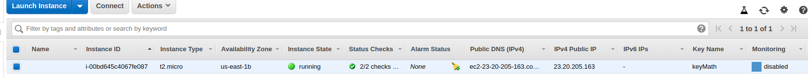
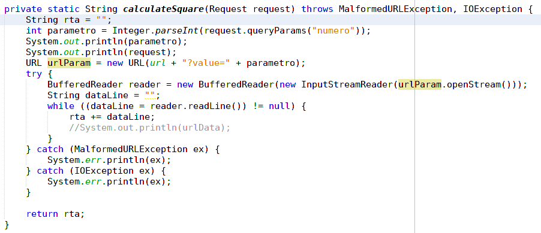
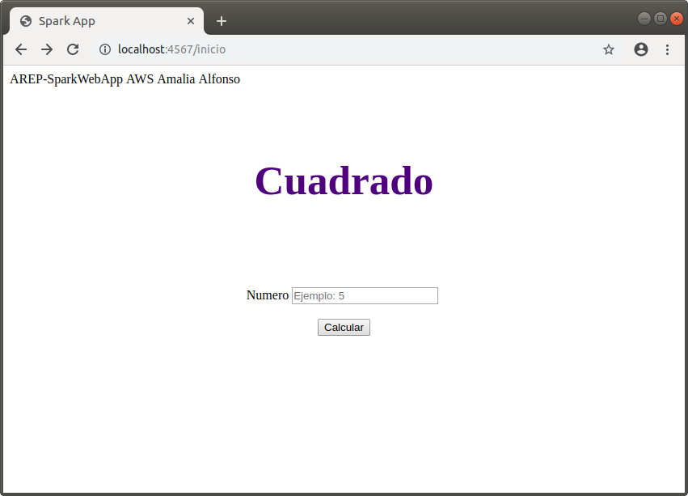
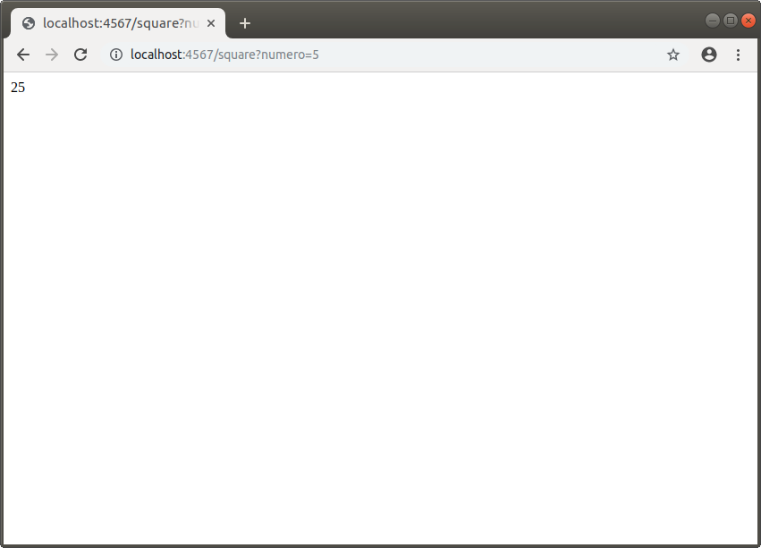
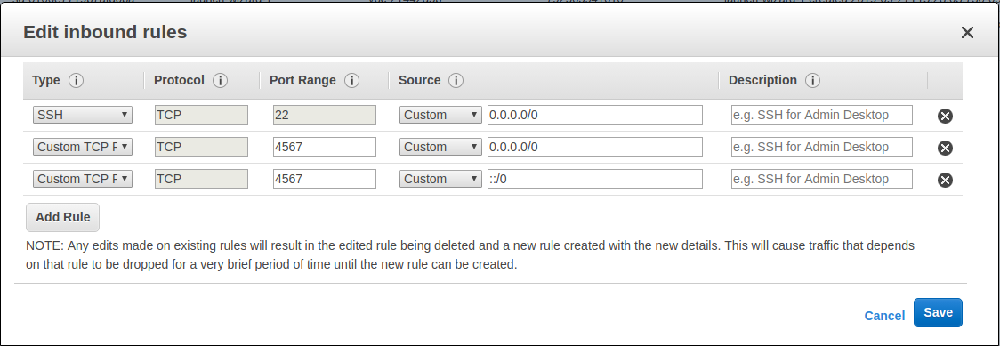
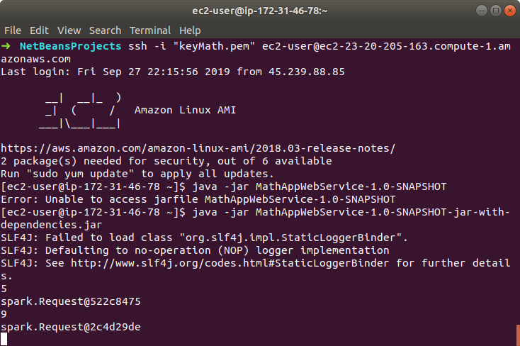
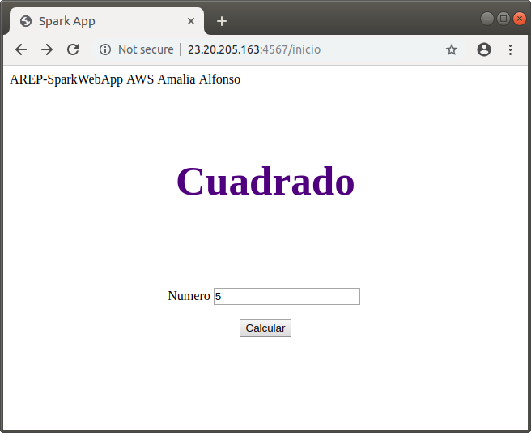
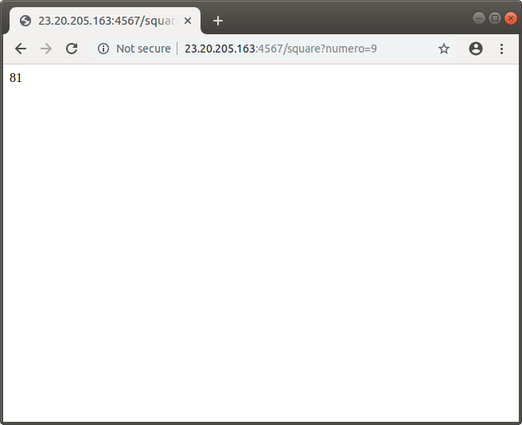

## Amazon Gateway y Lambda App 

En este repositorio, se creó una API con microservicios que recibe un parámetro numérico y retorna el cuadrado del número. Para esto se utilizaron servicios de amazon: Amazon Gateway y Lamba.
Amazon Gateway reduce la complejidad operativa ya que ejecuta API sin tener que administrar servidos y permite que la creación, publicación, mantenimiento y monitoreo de una API sea más fácil. Define los endpoints y métodos http.

Amazon Lambda tambien reduce la complejidad sin administrar servidores, y está muy integrado con AWS Gateway. Controla e integra los endpoints definidos en un API-Gateway.
___
### Documentación

Para leer la documentación diríjase a: <https://https://github.com/acai-bjca/MathAppWebService/tree/master/src/main/resources/documentacion/apidocs/eci/mathappwebservice>

___
### Uso del proyecto como librería
Si desea usar éste repositorio como librería en su proyecto, realice los siguientes pasos:

• Descargue o clone él repositorio SparkWebApp: <https://github.com/acai-bjca/SparkWebApp.git>

• Agregue la siguiente dependencia al pom de su proyecto:
``` xml
 <dependency>
	<groupId>eci</groupId>
    <artifactId>MathAppWebService</artifactId>
    <version>1.0-SNAPSHOT</version>
</dependency>
```

• Importe el proyecto en la clase que lo requiera:
import eci.*;

___
### Pruebas

A continuación se muestra el funcionamiento de la aplicación:

Primero se creó la instancia de un servicio EC2 en AWS en el que se subirá la aplicación
Como podemos ver el puerto asignado es : 23.20.205.163


El código de la aplicación web con spark que hace uso del servicio AWS es:



Aquí se probó el funcionamiento de la aplicación localmente haciendo uso del puerto 4567:



En las configuraciones "inbound rules", se agregó una nueva regla que permitiera ingresar por el puerto 4567:


Luego se ejecutó en consola la instancia creada y se subió la aplicación spark:


Se comprobó su funcionamiento con la dirección


___
### Construido con

• Java  
• [Maven] (https://maven.apache.org/) - Gestión de dependencias

___
### Autor

**Amalia Inés Alfonso Campuzano** 

Estudiante de la Escuela Colombiana de Ingeniería Julio Garavito

Ingeniería de Sistemas
___
### Licencia

Este proyecto está licenciado bajo la Licencia GNU - vea el archivo [LICENSE.md] (LICENSE.md) para más detalles.

